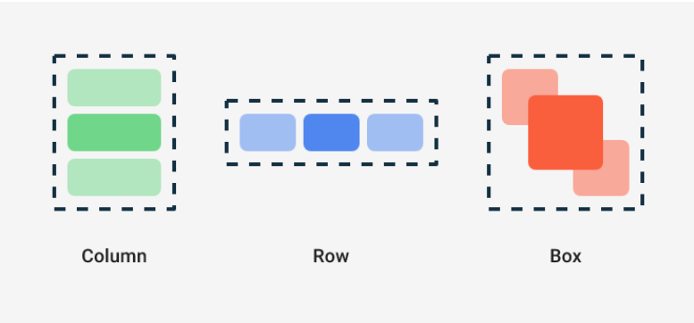

#### Jetpack Compose 기초 | Android Developers에 대해서 정리
### Compose의 세 가지 기본 표준 레이아웃 요소는 Column, Row, Box입니다.

이것들은 컴포저블 콘텐츠를 사용하는 구성 가능한 함수이므로 내부에 항목을 배치 가능하다. 예를 들어 Column 내부의 각 하위 요소는 세로로 배치됩니다.
```kotlin
Column {
    Text("First row")
    Text("Second row")
}
```

### Compose와 Kotlin
구성 가능한 함수는 Kotlin의 다른 함수처럼 사용할 수 있다. 이는 UI가 표시되는 방식에 영향을 주는 구문을 추가할 수 있어서 매우 강력한 UI를 제작할 수 있게 해준다.

예를 들어 for 루프를 사용하여 Column에 요소를 추가할 수 있다.

```kotlin
@Composable
fun MyApp(
    modifier: Modifier = Modifier,
    names: List<String> = listOf("World", "Compose")
) {
    Column(modifier) {
        for (name in names) {
            Greeting(name = name)
        }
    }
}
```