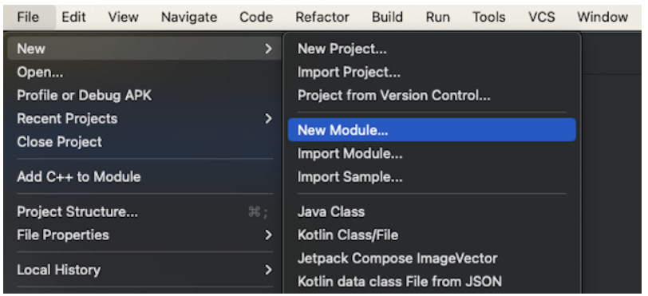
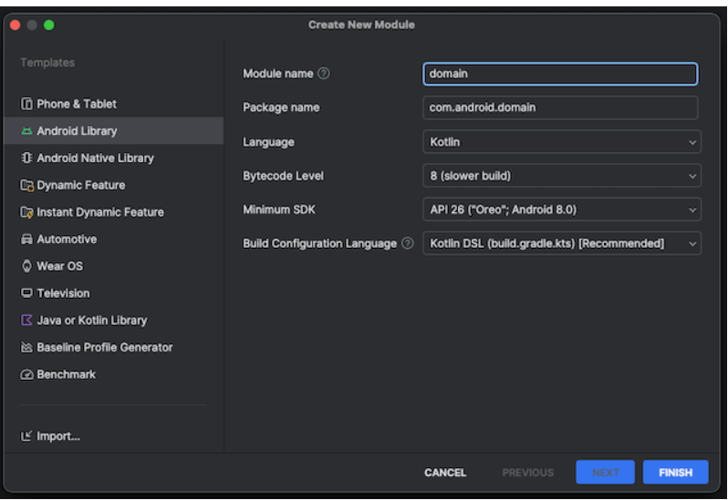
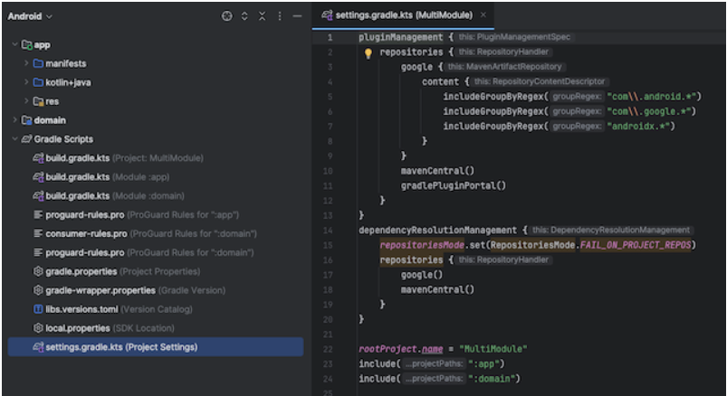

## Module
모듈은 앱을 구성하는 요소로, 관련된 소스 코드나 리소스 등을 하나로 묶는 단위이다.\
안드로이드 스튜디오에서 새 프로젝트를 만들 때, 자동으로 생성되는 'app'도 하나의 모듈

## Multi Module
멀티모듈 아키텍처는 애플리케이션을 여러 개의 독립적인 모듈로 나누어 개발하는 방법이다.\
애플리케이션을 모듈이라는 독립적인 단위로 분리하여 각각의 모듈이 독립적으로 기능을 수행하도록 하는 것이다.

## 생성 방법

안드로이드 스튜디오 상단에서 File - New - New Module을 선택\

Android Library 탭에서 생성할 모듈의 이름을 Module name에 입력하고 Finish

settings.gradle.kts 파일에서 'domain' 모듈이 추가 & 해당 모듈을 포함시키기 위해 include(":domain") 구문이 추가되어 app과 domain 두 개의 모듈이 함께 사용가능함

## 멀티모듈 장점
1. 기능을 독립적인 모듈로 나눔으로써 코드의 재사용과 유지보수성을 높일 수 있다.
2. 변경된 모듈만 빌드하므로 전체 빌드 시간이 줄어들 수 있다.
단, 모듈간 종속성이 복잡해지고 모듈의 수정이 많다면 빌드 시간이 증가될 수 있다.
3. 모듈 간의 의존성을 명확하게 정의하고 관리할 수 있다.
4. 각 모듈을 독립적으로 테스트할 수 있어 버그를 조기에 발견하고 해결할 수 있다.
5. 기능별로 코드를 분리하여 프로젝트의 구조를 이해하기 쉽게 유지할 수 있다.

## 멀티모듈 단점
1. 모듈 간의 의존성과 설정이 복잡할 수 있어 초기 설정과 관리가 어려울 수 있다.
2. 각 모듈의 빌드 설정을 별도로 관리해야 하므로 관리 오버헤드가 증가할 수 있다.
3. 모듈이 많아지면 프로젝트 구조가 복잡해져 이해하기 어려울 수 있다.