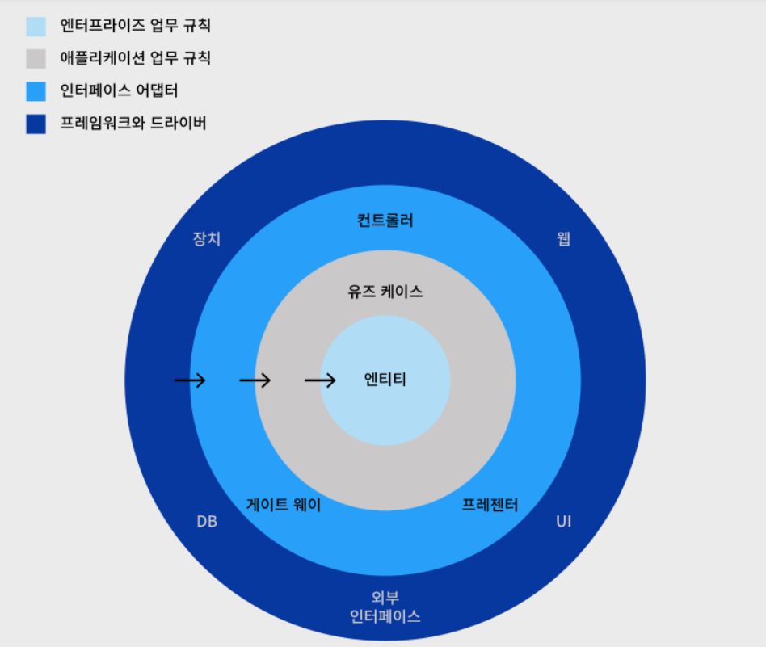

## 클린 아키텍처
**클린 아키텍처(Clean Architecture)** 는 소프트웨어 설계 패턴 중 하나로, 복잡한 시스템을 명확한 구조로 분리해 유지보수성을 높이고, 확장성과 테스트 가능성을 높이기 위한 원칙
+ 이 아키텍처는 **비즈니스 로직** 과 **애플리케이션** 의 세부 사항을 분명히 분리하는 것을 목표로 한다.

## 주요 원칙
+ **의존성 역전 원칙(Dependency Inversion Principle)**
고수준 모듈은 저수준 모듈에 의존해서는 안되며, 양쪽 모듈 모두 추상화에 의존해야 한다. 이를 통해 느슨한 결합을 유지할 수 있다.

+ **경계(Boundary)의 분리**
시스템을 여러 영역으로 나누고, 각 영역 사이의 인터페이스를 정의하여 각 영역의 독립성을 보장한다.

+ **인터페이스 분리 원칙(Interface Segregation Principle)**
클라이언트가 자신이 사용하지 않는 메서드에 의존하지 않아야 한다. 즉, 인터페이스는 클라이언트의 요구에 딱 맞는 형태로 분리되어야 한다.

+ 프레임워크와 드라이버, 인터페이스 어댑터, 애플리케이션 업무 규칙, 엔터프라이즈 업무 규칙 총 4가지 계층으로 나뉘어져 있으며 각 계층은 바깥에서 안쪽으로 의존성을 가진다.