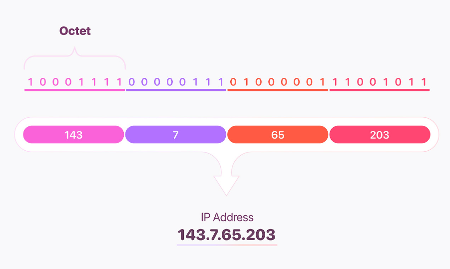

## IPv4 vs IPv6
이것들을 살펴보기 전에 ```옥텟(Octet)```이라는 것을 먼저 살펴보자\

옥텟이란, IP주소를 이진법으로 변환하여 8개씩 나눈 비트 단위를 말한다.
## IPv4
IPv4는 3자리 숫자가 4마디로 표기되는 방식으로 각 마디를 ```옥텟(octet)```라고 부른다.\
IPv4는 내부적으로 ```32bit``` 각 마디당 ```8bit```로 처리된다.


## IPv6
 IPv6는 총 128bit로 각 ```16bit```씩 8자리로 각 자리는 ```:(콜론)```으로 구분한다.

## IPv4와 IPv6의 특징비교
# IPv4 vs IPv6

| 구분 | IPv4 | IPv6 |
| --- | --- | --- |
| 주소 길이 | 32bit | 128bit |
| 표시 방법 | 8비트씩 4부분 10진수 표시 ex) 203.252.53.55| 16비트 8부분 16진수로 표시 ex) 2002:0221:ABCD:DCBA:0000:0000:FFFF:4002 |
| 주소 개수 | 약 43억개 | 2의 128승 개 (43억 x 43억 x 43억 x 43억 개) |
| 주소 할당 방식 | A,B,C,D 등의 클래스 단위 비순차 
할당 | 네트워크 규모, 단말기수에 따라 순차 할당 |
| 브로드캐스트 주소 | 있음 | 없음(대신 로컬범위 내에서 모든 노드에 대한 멀티캐스트 주소 사용) |
| 헤더 크기 | 가변 | 고정(불변) |
| Qos 제공 | 미흡 | 제공 |
| 보안  | IPSec 프로토콜 별도 설치 | IPSec 자체 지원 |
| 서비스 품질 | 제한적 품질 보장 (Type of Service에 의한 서비스 품질 일부 지원) | 확장된 품질 보장 (트래픽 클래스, 플로우 레이블에 의한 서비스 품질 지원) |
| Plug & Play | 불가 (DHCP 자동할당 이용시 가능) | 가능 |

## IPv4에서 IPv6로 변환
| 구분 | 설명|
| --- |--- |
|이중스택 | 모든인터넷이 IPv6를 사용하기 전까지 시스템은 IPv4와 IPv6를 동시에 지원 |
| 터널링(tunneling) | **1**. IPv6를 사용하는 두 호스트가 통신을 할 때 패킷이 IPv4를 사용하는 지역을 지나는 경우에 사용 가능한 방법 **2.** IPv4 지역에 들어서면 IPv6 패킷은 IPv4 패킷으로 캡슐화되고 이 지역을 벗어날 때 역캡슐화 |
| 헤더변환(header translation) | **1.** 인터넷의 대부분이 IPv6로 변경되고 일부만이 IPv4를 사용할 때 필요한 방법 **2.** 헤더 변환을 통해 헤더의 형태를 완전히 변경|