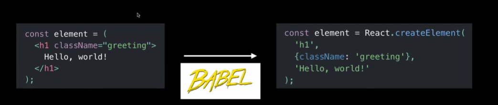

# JSX
React에서 HTML과 유사한 문법으로 UI 컴포넌트를 정의하는 문법 확장.
- JS에 XML을 추가한 JS확장 문법
- **JS 내에서 HTML문법**을 사용하는 것
- JSX는 JS가 아니므로, 브라우저가 이해할 수 없음
- 따라서, 리액트는 **Babel**이라는 컴파일러를 사용하여 **JSX → JS로 변환함**
\

## JSX 규칙⚠️
1. **class 대신 className**
2. **무조건 하나의 부모 요소로 감싸주어야 함**
- **div로 묶어주기 싫을 때는 빈 태그로 감싸주기**
- **빈 태그는 Fragment라고 부르며, 실제로 화면에 랜더링되지 않음**
1. **JSX내에서 JS 표현식을 사용하고 싶을 때는 중괄호 사용하기**